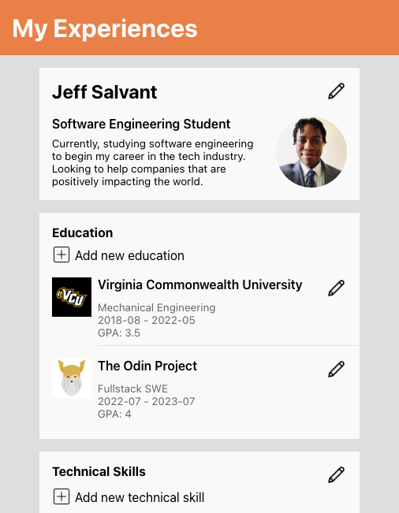

# cv-application

## [Live Demo](https://salvantjeff.github.io/cv-application/)

## Introduction
Created a customizable resume/cv application using react. There was a big emphasis on effectively using functional components, hooks, state management, life cycle methods, and testing. Testing components and their features helped catch bugs early and increased overall confidence in the application.

Achieving editing functionality was challenging. However, applying solid design principles like Single Responsibility (separation of concerns) and focusing on modularity enabled me to navigate how to manage the various states and life cycle methods for each form component to achieve editing features.
